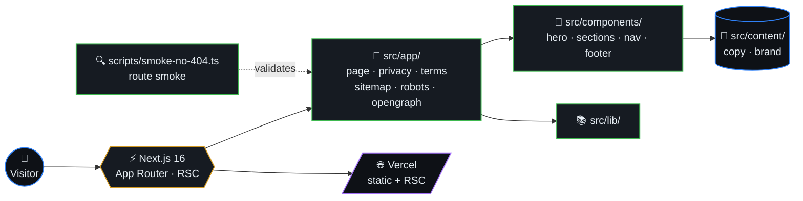
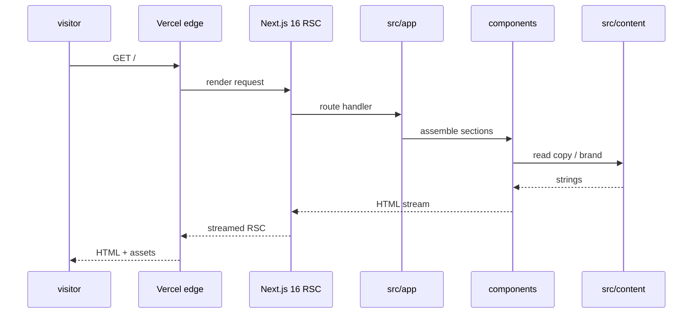
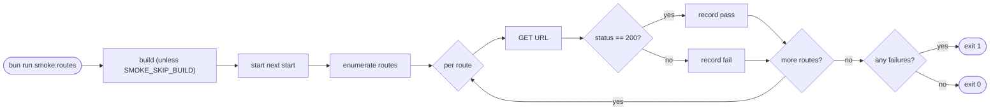

# W3 Sourcing

Next.js marketing site. **Use [Bun](https://bun.sh) for all installs and scripts** (see `packageManager` in `package.json`).



## Table of contents

- [Quick orientation](#quick-orientation)
- [Request flow (sequence)](#request-flow-sequence)
- [Route smoke (algorithm)](#route-smoke-algorithm)
- [Setup (step by step)](#setup-step-by-step)
- [Scripts](#scripts)
- [Documentation map](#documentation-map)
- [Project layout](#project-layout)
- [Deploy on Vercel (step by step)](#deploy-on-vercel-step-by-step)

## Request flow (sequence)



## Route smoke (algorithm)



## Quick orientation

This repo is a static Next.js marketing site for W3 Sourcing. If you are opening it cold, start with `docs/OVERVIEW.md`, then use the table below to jump into requirements, design, testing, or deployment.

The live site experience is intentionally navigable from the header and footer: home-page section links resolve through hash navigation, legal pages route to `/privacy` and `/terms`, and primary contact actions use direct email rather than a form.

## Setup (step by step)

1. Install Bun (version aligned with `packageManager` in `package.json` when possible).
2. From the repo root: `bun install`
3. `bun run dev` — opens the URL Next prints (default port **3000**, or the next free port if 3000 is taken; use `bun run dev -- -p 0` for an OS-assigned port). A **second** `next dev` for the same folder is not allowed by Next 16; this repo stops the previous dev server (using `.next/dev/lock`) before starting, so `bun run dev` is safe to re-run. To disable that, set `W3_REPLACE_NEXT_DEV=0`. Other scripts (`build`, `start`, `lint`) still use `exec-in-repo-root` so they work from a parent directory.

## Scripts

| Command                    | Purpose                                                         |
| -------------------------- | --------------------------------------------------------------- |
| `bun run dev`              | Development server                                              |
| `bun run build`            | Production build                                                |
| `bun run start`            | Serve production build                                          |
| `bun run lint`             | ESLint                                                          |
| `bun run test`             | Unit tests (`src/`) + TypeScript check                          |
| `bun run smoke:routes`     | Route smoke (default: build + `next start`)                     |
| `bun run smoke:routes:dev` | Route smoke against `next dev` (avoid if dev server is running) |
| `bun run smoke:routes:ci`  | Smoke after an existing build (`SMOKE_SKIP_BUILD=1`)            |

## Documentation map

| Document | Use it for |
| -------- | ---------- |
| `docs/OVERVIEW.md` | Project purpose, routes, section order, navigation behavior, and commands. |
| `docs/REQUIREMENTS.md` | Product requirements, content constraints, non-goals, and quality bar. |
| `docs/DESIGN.md` | Visual system, component behavior, motion rules, theme, and responsive notes. |
| `docs/TESTING.md` | Local checks, route smoke behavior, CI expectations, and image-loading contracts. |
| `docs/DEPLOYMENT.md` | Bun/Vercel deployment, SEO environment variables, and CI deployment gates. |

## Deploy on Vercel (step by step)

1. Push the repo; ensure **`bun.lock`** is committed and there is **no** root `package-lock.json`.
2. Import the project in [Vercel](https://vercel.com/new); defaults should pick up **`vercel.json`** (`bun install --frozen-lockfile`, then `bun run lint && bun run build && bun run smoke:routes:ci`).
3. Confirm in the deployment build log that dependencies install with **Bun**.

More detail: **`docs/DEPLOYMENT.md`**.

## Project layout

```
src/
  app/             # Next.js App Router (page, privacy, terms, sitemap, robots, OG)
  components/      # Hero, sections, nav, footer
  content/         # Marketing copy + brand assets
  lib/             # Shared helpers
scripts/           # Bun helpers — run-next-dev, smoke-no-404, exec-in-repo-root
docs/              # OVERVIEW · REQUIREMENTS · DESIGN · TESTING · DEPLOYMENT
public/            # Static assets
vercel.json        # Vercel build config
```
